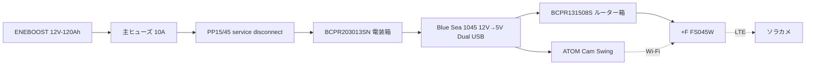

# Power And Wiring

## 前提

- 対象は `7日間 / ソーラーなし / LTE(FS045W + 楽天モバイル Rakuten最強プラン) / 1台運用` の構成
- バッテリーは `ENEBOOST 12V-120Ah`
- カメラは `ATOM Cam Swing`
- `12V -> 5V` 変換には `Blue Sea 1045` を使う
- 電装箱は `タカチ BCPR203013SN`、ルーター保護箱は `タカチ BCPR131508S + PMF-6B` とする
- バッテリー箱と電装箱の切り離しは `Anderson Powerpole PP15/45` を `電装箱内` に置いて行う

## 配線の考え方

- 一次側は `バッテリー + 主ヒューズ + 5V変換器`
- カメラは `5V USB` で給電する
- 週次交換運用を優先し、構成は `単純` に保つ
- 常設充電器は置かず、バッテリーは持ち帰って充電する

## 基本構成の配線図

## 実装メモ

- `主ヒューズ` はバッテリー `+端子` の近くに置く
- `Blue Sea 1045` は `BCPR203013SN` の下面または側面に固定する前提
- `USBケーブル 4.5m` は `Blue Sea 1045` からカメラまでを一気に引く
- `USBの接続点` は屋外露出させず、`BCPR203013SN` の内側に収める
- `PP15/45` は屋外露出させず、`BCPR203013SN` の内側で切り離す
- `バッテリー箱` と `電装収納箱` を分けると、交換と点検がやりやすい
- `FS045W` は `Blue Sea 1045` の空き USB ポートに同梱 `USB Type-C ケーブル` を挿して給電する
- `FS045W` は `BCPR131508S` に分け、側面へ `PMF-6B` を入れて通気を確保する
- `電装箱` と `バッテリー箱` はカメラ直下のポールへ寄せる
- `積雪` を考えて箱の底は地面から離し、`直射日光` を考えて `白色アルミ複合板 300 x 300 x 3mm + 30mm スペーサ` の小庇を箱の真上へ付ける
- `FS045W` の動作温度範囲は `0°C〜35°C` なので、密閉しすぎず通風を確保する

## 保留事項

- `Blue Sea 1045` の固定穴加工位置
- `BCPR203013SN`、`BCPR131508S`、`バッテリー箱` の上下配置順
- カメラ側ケーブル余長の逃がし方
