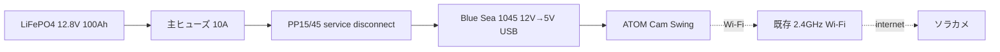
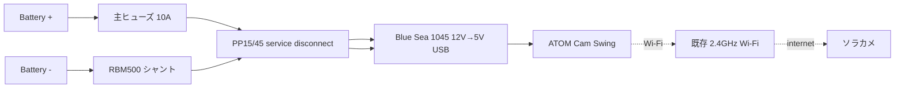
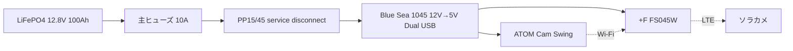

# Power And Wiring

## 前提

- 対象は `7日間 / ソーラーなし / 既存 Wi-Fi あり / 1台運用` の構成
- バッテリーは `12.8V 100Ah LiFePO4`
- カメラは `ATOM Cam Swing`
- `12V -> 5V` 変換には `Blue Sea 1045` を使う
- `Renogy RBM500` は任意。入れる場合は負極側にシャントを入れる
- バッテリー箱と電装箱の切り離しは `Anderson Powerpole PP15/45` を `電装箱内` に置いて行う

## 配線の考え方

- 一次側は `バッテリー + 主ヒューズ + 5V変換器`
- カメラは `5V USB` で給電する
- 週次交換運用を優先し、構成は `単純` に保つ
- 常設充電器は置かず、バッテリーは持ち帰って充電する

## 最小構成の配線図

## バッテリーモニタを入れる場合

## LTE ルーターを入れる場合

## 実装メモ

- `主ヒューズ` はバッテリー `+端子` の近くに置く
- `Blue Sea 1045` は `WP20-28-7G` の蓋または側面に固定する前提
- `USBケーブル 4.5m` は `Blue Sea 1045` からカメラまでを一気に引く
- `USBの接続点` は屋外露出させず、`WP20-28-7G` の内側に収める
- `PP15/45` は屋外露出させず、`WP20-28-7G` の内側で切り離す
- `バッテリー箱` と `電装収納箱` を分けると、交換と点検がやりやすい
- `FS045W` を使う場合、`Blue Sea 1045` の空き USB ポートに同梱 `USB Type-C ケーブル` を挿して給電する
- `FS045W` は電波状態を見て、`WP20-28-7G` 同居より `別箱` や `箱外近傍` に置く方が安定しやすい場合がある
- `120Ah` は必須ではなく、寒冷地や交換余裕を増やしたいときの上積み

## 保留事項

- `Blue Sea 1045` の固定穴加工位置
- `WP20-28-7G` と `NOCO BG31` の現地固定方法
- カメラ側ケーブル余長の逃がし方
- `FS045W` をどの位置に置くと LTE 受信が最も安定するか
