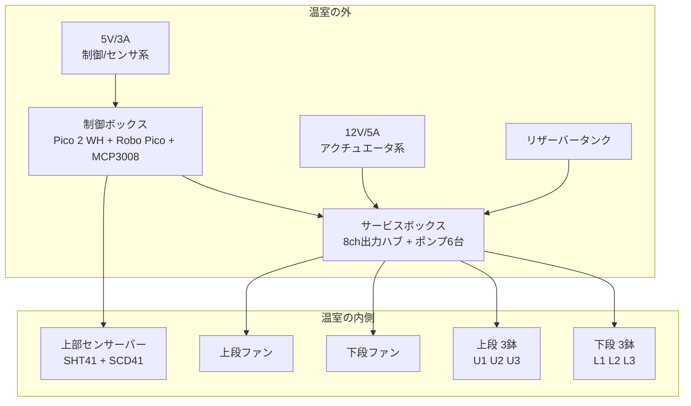

# Layout And Cabling

## Assumed layout

## Placement rules

- 制御ボックスは温室外の上側に固定する。
- サービスボックスは温室外の下側に固定し、ポンプ交換を前面からできるようにする。
- センサーバーは温室上部中央にまとめる。
- 鉢は `上段3鉢` と `下段3鉢` に分ける。
- タンクはサービスボックスの横または下に置く。

## Cable routing rules

- `上段ハーネス` と `下段ハーネス` の2束に分ける。
- 各束は `土壌水分センサー3本` と `チューブ3本` で構成する。
- センサー線は左後方、チューブは右後方へ寄せる。
- 扉、ジッパー、開閉フレームをまたぐ配線は避ける。
- サービスボックスから温室への引き込みは背面上部または側面上部の 1 か所にまとめる。
- 引き込み口の直前にドリップループを作る。

## Practical implication

- 6鉢では `1鉢ごとの単独配線` より `棚単位の束` にした方が保守しやすい。
- ポンプとドライバを箱にまとめると、ポンプ交換時に制御基板へ触れずに済む。
- 先に `U1-U3 / L1-L3` の番号を固定してから配線する方が後で迷わない。
