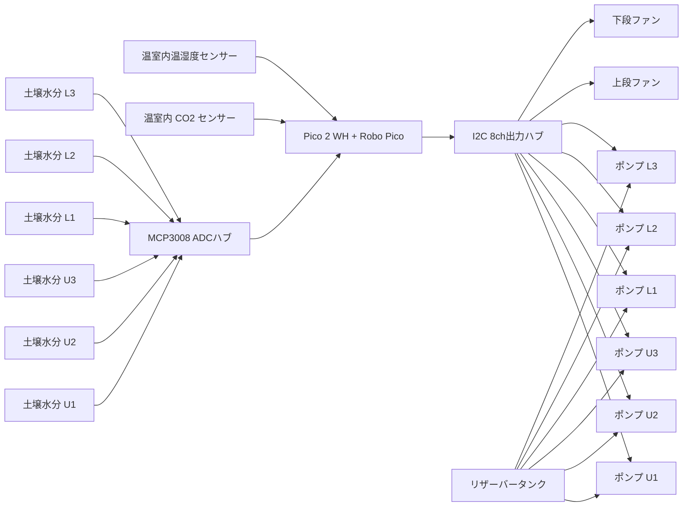

# System Overview

```mermaid
flowchart LR
    A["温室内温湿度センサー"] --> C["Pico 2 WH + Robo Pico"]
    B["温室内 CO2 センサー"] --> C
    M["MCP3008 ADCハブ"] --> C
    S1["土壌水分 U1"] --> M
    S2["土壌水分 U2"] --> M
    S3["土壌水分 U3"] --> M
    S4["土壌水分 L1"] --> M
    S5["土壌水分 L2"] --> M
    S6["土壌水分 L3"] --> M
    C --> D["I2C 8ch出力ハブ"]
    D --> P1["ポンプ U1"]
    D --> P2["ポンプ U2"]
    D --> P3["ポンプ U3"]
    D --> P4["ポンプ L1"]
    D --> P5["ポンプ L2"]
    D --> P6["ポンプ L3"]
    D --> F1["上段ファン"]
    D --> F2["下段ファン"]
    T["リザーバータンク"] --> P1
    T --> P2
    T --> P3
    T --> P4
    T --> P5
    T --> P6
```

## Notes

- 6鉢は `上段3 + 下段3` を基準にする。
- 水分入力は `ADCハブ`、出力は `8ch出力ハブ` に集約する。
- 給水は `1回に1鉢` だけを駆動する。
